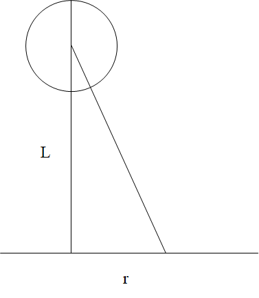

# 电子衍射

## 电子衍射原理

### 布拉格定律

Bragg's Law

$$
2d_{hkl}\sin\theta=n\lambda
$$

干涉指数$d_{nhnknl}=\frac{d_hkl}{n}$

$\lambda\le2d$ 时才产生Bragg衍射

能产生Bragg衍射的晶面几乎平行于入射束

### 倒易点阵和Ewald作图

倒易点阵固物X光都讲过了，不说了（

### 结构因子

入射波被两个点散射，两散射波的光程差

$$
\delta_{OA}=\overline{BO}+\overline{OC}=-K_0\cdot r_n+K_g\cdot r_n=(K_g-K_0)\cdot r_n
$$

电子束受到单胞散射的合成振幅

$$
F=\sum_{j=1}^nf_j\exp2\pi i(K_g-K_0)\cdot r_j
$$

代入衍射条件$K_g-K_0=g$，$g$为倒空间点阵矢量，$r_j$是为正空间点阵矢量

$$
F_{hkl}=\sum_{j=1}^nf_j\exp2\pi i(hx_j+ky_j+lz_j)
$$

衍射强度正比于振幅平方，F=0意味着消光

（推导不写了）

#### 消光

- FCC：只有全奇全偶有振幅，其余全消光
- BCC：hkl和为偶数有振幅，奇数消光

### 干涉函数

（X光课上好像管这个叫劳埃函数）

真实晶体大小有限且内部有缺陷，因此倒易点有一定大小，使得产生电子衍射的可能性增加

取一个柱晶（z方向上堆叠），所有单胞的合成振幅：

$$
A=\sum_{n=1}^{N_z}F_n\exp(i2\pi(K_g-K_0)\cdot r)
$$

若满足了布拉格条件，则所有单胞具有相同位相，$A=N_zF$

若衍射方向有偏离：$K_g-K_0=g+s$

$$
A=\sum_{n=1}^{N_z}F_n\exp{(i2\pi s\cdot r)}
$$

$$
A=F\frac{\sin(\pi sN_zc)}{\pi s}e^{i\pi sN_zc}
$$

$$
I=|A|^2=|F|^2\frac{\sin^2(\pi sN_zc)}{(\pi s)^2}
$$

后面一坨就是干涉函数了，其**主极大值两边的零点**决定了相干散射的范围

晶体越薄，参加相干散射的单胞越少，倒易点的拉长越多，与Ewald球的相切机会越大

（三维的不说了，叠一遍就行

### 衍射花样与晶体几何关系

近似公式$rd=L\lambda$，一般$L\lambda$已知（仪器常数），可以用来求d

## 倒易点阵平面及其画法

### 晶带定律

晶带：与一个晶体学方向[uvw]平行的一组晶面族的总称，[uvw]方向称为晶带轴

晶带中晶面族的倒格矢垂直于晶带轴$hu+kv+lw=0$

### 二维倒易点阵平面画法

已知晶体结构，画$(uvw)^*$倒易面

1. 先蒙两个低指数的
2. 求和，画个平行四边形，再往外扩展（立方晶系的话最好优先找直角）
3. 除去消光的点
4. 查查有没有漏掉的

## 选区电子衍射

## 多晶电子衍射花样和相机长度标定

参考X光，多晶的衍射花样是一系列同心圆环。重要公式：

$$
r=L\lambda/d
$$

对同一衍射花样，$L\lambda$是定值，故

$$
r_1:r_2:r_3:\dots:r_j:\dots=\frac1{d_1}:\frac1{d_2}:\frac1{d_3}:\dots:\frac1{d_j}\dots
$$

### 立方晶系

$$
d=\cfrac{a}{\sqrt{h^2+k^2+l^2}}=\frac{a}{\sqrt{N}}
$$

$$
r_1:r_2:r_3:\cdots=\sqrt{N_1}:\sqrt{N_2}:\sqrt{N_3}:\cdots
$$

#### FCC

| 111  | 200  | 220  | 311  | 222  | 400  | 331  | 422  | ...  |
| ---- | ---- | ---- | ---- | ---- | ---- | ---- | ---- | ---- |
| 3    | 4    | 8    | 11   | 12   | 16   | 19   | 20   | ...  |

#### BCC

| 110  | 200  | 211  | 220  | 310  | 222  | 321  | ...  |
| ---- | ---- | ---- | ---- | ---- | ---- | ---- | ---- |
| 2    | 4    | 6    | 8    | 10   | 12   | 14   | ...  |

#### SC

| 100  | 110  | 111  | 200  | 210  | 211  | 220  | ...  |
| ---- | ---- | ---- | ---- | ---- | ---- | ---- | ---- |
| 1    | 2    | 3    | 4    | 5    | 6    | 8    | ...  |

金刚石：3、8、11、16、19、24...

### 四方晶系

$$
d=\frac{1}{\sqrt{\cfrac{h^2+k^2}{a^2}+\cfrac{l^2}{c^2}}}
$$

取$M=h^2+k^2$，对$l=0$的衍射环

$$
r^2_1:r^2_2:r^2_3:\dots=M_1:M_2:M_3:\cdots=1:2:4:5:8:9:10:13:16:17:18:\cdots
$$

### 六方晶系

$$
d=\frac1{\sqrt{\cfrac{4}3\cfrac{h^2+hk+k^2}{a^2}+\cfrac{l^2}{c^2}}}
$$

令$P=h^2+hk+k^2$，对l=0

$$
r^2_1:r^2_2:r^2_3:\dots=P_1:P_2:P_3:\cdots=1:3:4:7:9:12:13:16:19:21:\cdots
$$

### 多晶花样标定步骤

1. 利用已知样品，确定仪器常数$L\lambda$
   - 测定衍射环半径（为减小误差可以先测直径再转成半径）
   - 计算$r^2$，分析规律，得出N值（若为立方晶系）
   - 根据晶体结构标定各衍射环的指数，并从ASTM卡片中找出对应的晶面间距
   - $r_id_i=L\lambda$，计算出仪器常数，取平均值
2. 已知仪器常数，根据衍射花样，确定样品的晶体对称性
   - 测衍射环半径
   - 计算$r^2$，分析规律，估计晶体结构或点阵
   - $r_id_i=L\lambda$计算$d_i$
   - 估计各衍射环的相对强度，由三强线的d值查ASTM卡片索引，最终确定物相

常用标准样品有TlCl、Au、Al等，可以真空蒸发沉积得到细小多晶薄膜

## 单晶电子衍射花样

只有在倒易原点$O^*$附近，与Ewald球相交的那些倒易阵点所代表的晶面满足Bragg定律产生衍射束

### 零阶劳厄带ZOLZ

晶带[uvw]中所有晶面的倒易阵点或倒易矢量必须都在垂直于[uvw]且过倒易原点$O^*$的一个倒易平面内，记作$(uvw)_0^*$，称为零阶劳厄带

相应的，不过倒易原点的倒易面，即$hu+kv+lw=N$的倒易面称为**高阶（N阶）劳厄带**

### 单晶电子衍射花样的标定

1. 衍射谱相当于一个倒易平面，如电子束的入射方向与晶体[uvw]方向平行，则产生衍射的晶面指数为{hkl}，遵循晶带定律$hu+kv+lw=0$
2. 根据衍射花样与晶体间的几何关系，各衍射斑点到中央透射斑点O的距离满足$rd=L\lambda$
3. 两个不同方向的倒易矢量确定一个倒易点阵平面$(uvw)_0^*$（参考先前的倒易点阵平面画法）

分析包括两类：

- 已知晶体结构，根据衍射花样确定晶体取向
- 对于未知结构，通过衍射花样确定物相

#### 已知结构确定取向

1. 看看是不是简单电子衍射谱（满足晶带定律）。如果是，在花样上选3个离中心最近的衍射斑点P1P2P3，和中心构成平行四边形，测量三个点到中心的距离

2. 测所选衍射斑点的夹角

3. $rd=L\lambda$将距离换成面间距d

4. 查ASTM表，确定晶面族

5. 试探法选一套指数符合$h_3k_3l_3=h_1k_1l_1+h_2k_2l_2$

6. 代入晶面夹角公式

$$
\cos\phi=\frac{h_1h_2+k_1k_2+l_1l_2}{\sqrt{h_1^2+k_1^2+l_1^2}\sqrt{h_2^2+k_2^2+l_2^2}}
$$

   核对，一致则说明蒙对了，不对就重来

7. 矢量相加法标出其余斑点，用晶带定律进一步核实指数

8. 反求出晶带轴指数（叉乘），定义晶带轴指数和入射电子束方向反平行

**太\*\*抽象了，建议看课本P88例4.4过一遍流程**

#### 未知结构鉴定物相

1. 看看是不是简单电子衍射谱（满足晶带定律）。如果是，在花样上选3个离中心最近的衍射斑点P1P2P3，和中心构成平行四边形，测量三个点到中心的距离  ~~和之前一样~~
2. 测衍射斑点之间夹角
3. $rd=L\lambda$将距离换成面间距d
4. 根据成分、工艺及其它信息猜物相，并找到ASTM卡片，对照得到{hkl}
5. 试探法选指数
6. 计算是否夹角相符
7. 如果都没问题，说明物相猜对了
8. 确定晶带轴

~~这不就是和前面一样吗~~

注意标定的晶带方向具有180°不确定性

### 能看到单晶衍射谱的原因

- Ewald球半径大（电子波长短），且样品很薄，倒易点拉长成倒易杆，容易同时截到，产生多个衍射斑点
- 电子束有一定发散度
- 薄晶体试样不一定平整
- 加速电压不稳定导致Ewald球半径扫动

### 衍射花样和晶体几何关系

对称性快速判断晶系：

- 四方点列：四方晶系、立方晶系
- 六角点列：六角、三角、立方晶系
- 六次对称衍射谱：六角、立方晶系

运用排除法等，结合多个角度的衍射谱判断

### 四方晶系衍射谱标定

$$
\frac1{d^2}=\frac{h^2+k^2}{a^2}+\frac{l^2}{c^2}
$$

$$
a^*=\frac1a,\ \ c^*=\frac1c,\ \ M=h^2+k^2
$$

$$
\frac1{d^2}=M{a^*}^2+l^2{c^*}^2
$$

M规律：1，2，4，5，8，9，10，13，16，17，18，20……

任意一个M乘2就可以得到另一个允许的M

包含2的因子的反射都是{hk0}形式，可以求点阵常数a，再求出c

规律：

- 不同晶面l指数相同时

  $$
  \frac1{d_1^2}-\frac1{d_2^2}=(M_1-M_2){a^*}^2
  $$

  通过一系列相减可以得出${a^*}^2$

- 不同衍射晶面的M相同时，有

  $$
  \frac1{d_1^2}-\frac1{d_2^2}=(l_1^2-l_2^2){c^*}^2
  $$

  一系列相减可以得到${c^*}^2$或${c^*}^2$的倍数

- 都不相同时

  $$
  \frac1{d_1^2}-\frac1{d_2^2}=(M_1-M_2){a^*}^2+(l_1^2-l_2^2){c^*}^2
  $$

有时需要查询ASTM卡片

### 六方晶系衍射谱标定

$$
\frac1{d^2}=\frac{h^2+hk+k^2}{3a^2/4}+\frac{l^2}{c^2}=H{a^*}^2+l^2{c^*}^2
$$

H的3：1关系，但可能会被l掩盖

（摆了）

## 其它电子衍射谱

### 单晶、多晶、非晶

### 织构

（或许可以理解作单晶的有限空间旋转

### 二次衍射

衍射束作为入射束再次发生衍射，可能导致结构因子为0的地方产生衍射斑点

### 高阶劳厄带

提供倒空间中的三维信息

### 菊池线

试样厚度较大且单晶较完整时出现，一系列平行的亮暗线

**成因：**经过非相干散射失去较少能量的电子随后又受到弹性散射所产生

菊池线对转动非常敏感，相比之下单晶衍射斑点对小范围转动不敏感（几°以内）

**用途：**精确测定晶体取向，校正样品杆倾转角度，测定偏离矢量s