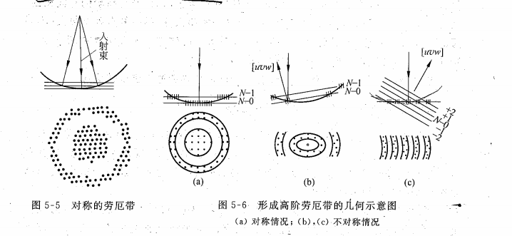

# 复杂电子衍射谱

## 孪晶

孪晶倒易点可以用同一对称轴的二次旋转操作得到，即：任意倒易矢$g_M$或倒易点hkl绕孪晶轴[HKL]旋转180度后成为孪晶的对应倒易矢量$g_T$或倒易点$hkl_T$，在基体点阵中的指数记为$h^tk^tl^t$
$$
[hkl]+[h^tk^tl^t]=n[HKL]
$$
利用d相等，对正交晶系：

$$
n=\frac{2\left(\cfrac{Hh}{a^2}+\cfrac{Kk}{b^2}+\cfrac{Ll}{c^2}\right)}{\left(\cfrac{H}{a}\right)^2+\left(\cfrac{K}{b}\right)^2+\left(\cfrac{L}{c}\right)^2}
$$

$$
\begin{cases}
h^t=\cfrac{H\left(\cfrac{Hh}{a^2}+\cfrac{2Kk}{b^2}+\cfrac{2Ll}{c^2}\right)-h\left(\cfrac{K^2}{b^2}+\cfrac{L^2}{c^2}\right)}{\left(\cfrac{H}{a}\right)^2+\left(\cfrac{K}{b}\right)^2+\left(\cfrac{L}{c}\right)^2}
\\
k^t=\cfrac{K\left(\cfrac{2Hh}{a^2}+\cfrac{Kk}{b^2}+\cfrac{2Ll}{c^2}\right)-k\left(\cfrac{H^2}{a^2}+\cfrac{L^2}{c^2}\right)}{\left(\cfrac{H}{a}\right)^2+\left(\cfrac{K}{b}\right)^2+\left(\cfrac{L}{c}\right)^2}
\\
l^t=\cfrac{L\left(\cfrac{2Hh}{a^2}+\cfrac{2Kk}{b^2}+\cfrac{Ll}{c^2}\right)-l\left(\cfrac{H^2}{a^2}+\cfrac{K^2}{b^2}\right)}{\left(\cfrac{H}{a}\right)^2+\left(\cfrac{K}{b}\right)^2+\left(\cfrac{L}{c}\right)^2}

\end{cases}
$$

对立方晶系，a=b=c，简化为：

$$
n=\cfrac{2(Hh+Kk+Ll)}{H^2+K^2+L^2}
$$

$$
\begin{cases}
h^t=-h+\cfrac{2H}{H^2+K^2+L^2}(Hh+Kk+Ll)
\\
k^t=-k+\cfrac{2K}{H^2+K^2+L^2}(Hh+Kk+Ll)
\\
l^t=-l+\cfrac{2L}{H^2+K^2+L^2}(Hh+Kk+Ll)
\end{cases}
$$

FCC的[HKL]=<111>, BCC的[HKL]=<112>

一般来说，电子束与[HKL]平行时，孪晶斑点与基体斑点重合

（后面怎么越来越看不懂了【哭】）

**矩阵分析：**把上面的变换写成矩阵形式

立方晶系

$$
\begin{bmatrix}
h^t\\k^t\\l^t
\end{bmatrix}
=T
\begin{bmatrix}
h\\k\\l
\end{bmatrix}
$$

$$
T=\cfrac1{H^2+K^2+L^2}
\begin{bmatrix}
H^2-K^2-L^2 & 2HK & 2HL\\
2KH & K^2-L^2-H^2 & 2KL\\
2LH & 2LK & L^2-H^2-K^2
\end{bmatrix}
$$

可以提前代入化简分母

## 高阶劳厄带

广义晶带定律$hu+kv+lw=N$

当晶体的点阵常数较大（倒易面间距较小），而晶体较薄的情况下，几个劳厄带可以**重叠**在一起，形成嵌套图案

- 对同一晶体，高的加速电压导致小的电子束波长，使曲率半径增大，难与高阶倒易面相截，出现高阶劳厄带的几率变小
- 对同一实验条件，晶体点阵常数大，不同层倒易面越靠近，出现高阶劳厄带的几率越大
- 晶体在入射方向越薄，倒易点拉长越厉害，出现高阶劳厄带几率越大
- 若晶带轴不严格平行于入射方向，高阶劳厄带出现机会也会增加

### 非零层倒易点在零层上的投影

高阶劳厄带中衍射斑点的配置相当于非零层倒易面上倒易点沿着衍射线方向在底片上的投影。可以近似认为是沿着晶带轴方向的投影

## 菊池线

### 产生

穿透较厚（>1000A）的完整单晶试样时，得到的一系列平行的亮暗线。电子经过非弹性散射失去较少能量，再受到弹性散射所致

### 几何特征

任一平面的边线与底板相交于暗线和亮线之间的一半之处，也即hkl线对的中线

随hkl面转动而转动，对晶体取向敏感，能够精确测定晶体取向

晶面与入射电子束夹角$\phi$：

- $\phi=0$时，即晶面hkl与入射电子束平行，菊池线对称出现在中心透射斑点的两侧
- $\phi=\theta$时，即晶体严格处于布拉格衍射位置时，菊池线正好通过hkl衍射斑点

**菊池极：**两个菊池线中线的交点，一般不止一个。多个菊池极可以精确测定晶体取向

### 指标化

利用$\phi$在0和$\theta$两个特殊值的特殊情况确定

### 应用

#### 测晶体取向：三菊池极法

#### 测试样倾转角

#### s矢量

## 超点阵与长周期

产生新的衍射斑点

超点阵：原本的消光位置出现弱的衍射斑点

长周期：在基体衍射斑点外，出现一系列间隔较密、排列成行的衍射斑点，间距反比于长周期周期长度