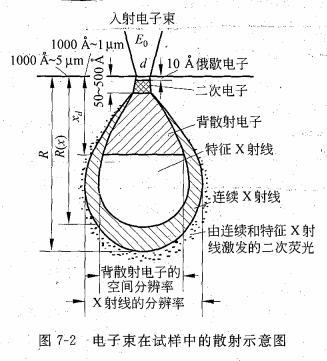

# SEM

## SEM基本结构与原理

### 基本原理

电子束会聚后在样品表面扫描，产生各种信号被接收

### 工作方式

- 二次电子

  - 反映试样表面形貌，主要用于形貌观察
  - 束斑越细，产生二次电子的面积越小
  - 分辨率高

- 背散射电子

  - 入射电子在试样中受到原子核卢瑟福散射而形成的**大角度散射电子**
  - 分辨率较低（薄样品在TEM里做扫描透射像的分辨率也不低）
  - 对试样的原子序数变化敏感，产额随原子序数增加而增加，适合观察成分的空间分布
  - 衬度主要与原子序数有关，与表面形貌也有一定的关系
  - 能反映试样离表面较深处的情况

- 吸收电子

  - 与二次电子、背散射电子相反

- 特征X射线

  - 外层向内层跃迁，同时放出特征X射线

    
    $$
    \lambda=\frac1{(Z-\sigma)^2}
    $$
    

- 俄歇电子

  - 给出表面信息，SEM中用的不多

## SEM衬度原理

衬度三大来源：

- 试样本身性质（表面凹凸、成分差别、位相差异、表面电位分布）
- 信号本身性质（二次电子、背散射电子、吸收电子）
- 对信号的人工处理

### 二次电子

- 二次电子产额：随入射电子能量先增加后减少
- 角分布：余弦规律（表面上放一个圆），表面法线方向信号最大
- 产额与入射角：入射角越大，产额越高

**形貌衬度**：与发射面和收集器之间的角度有关

**原子序数衬度**：不明显

**电压差衬度**：试样表面负电位处二次电子逸出容易，故衬度大

**充电现象**：非导电材料表面的电荷积累导致衬度过亮

### 背散射电子

> 背散射系数$\eta$：一个初始电子产生一个能量大于50eV而小于初始能量的电子的几率

$\eta$ 随靶原子序数Z的增加而增加，入射电子束影响小：

- Z < 47: $\eta$ 随入射电子能量的增加而降低
- Z = 47: $\eta$ 随入射电子能量的增加而没啥变化
- Z > 47: $\eta$ 随入射电子能量的增加而增加

入射电子方向对$\eta$的影响：

- 垂直入射时，分布近似余弦规律，发射方向随机
- 倾斜入射时：向前的棒形
- 随入射角增加，背散射电子数也相应增加。接近掠射角时接近1

**衬度**：主要是原子序数衬度，重元素亮，轻元素暗

可以用来看析出物成分

利用一对对称的探测器AB，作加减法可以分离形貌像与成分像（利用对称性）

背散射成分分析时为避免形貌衬度干扰，可以做表面抛光

### 扫描透射电子像

薄试样的透射电子可以成像（STEM像）

- 基本不受色差的影响。像的质量比一般TEM要好
- 可以用能量分析器选择某个能量的弹性散射电子来分析
- 能量损失与试样成分有关，非弹性散射电子像（特征能量损失电子像）也可以用来显示元素分布
- 一般都是TEM里测出来的（因为样品很薄），除非给SEM装一个特殊的样品台（STEM-in-SEM）

## 分辨率与放大倍数

### 电子束影响

$$
d^2=d_0^2+d_s^2+d_c^2+d_f^2
$$

> $d$：实际电子束直径
>
> $d_0$：电子枪发出的电子束直径
>
> $d_s=1/2 C_s\alpha^3$：球差漫散圆直径
>
> $d_c=C_c\alpha \Delta V_0/V_0$：色差漫散圆直径
>
> $d_f=1.22\times10^{-10}\sqrt{150}/(\alpha V_0)$：衍射效应导致的电子束漫散圆直径

球差为最主要因素，$d^2=d_0^2+d_s^2=d_0^2+1/2C_s\alpha^3$

### 信噪比影响

信噪比

$$
P=\sqrt{\frac{I_s\tau}{Ne}}
$$

> $I_s$：探测器接受到的信号，与电子束流$I_p$成正比
>
> $\tau$：帧扫描时间
>
> $N$：像元数目

优化思路

- 增大电子束流：用强电子源（LaB6枪或场发射枪）**提高亮度**；增大束斑（会降低分辨率）
- **加长帧扫描时间**：最慢100s（电路稳定度限制不能太长
- 减少像元数目（会降低清晰度

### 放大倍数

$$
M=\frac l L
$$

>$l$：荧光屏长度
>
>$L$：电子束在试样上扫过的长度

## 性能特点

### 分辨率

二次电子像分辨率最高，一般说的分辨率就是二次电子像的。

热钨丝发射电子枪一般30-60A

场发射枪一般10-20A

顶级：个位数A

### 放大倍数

连续可调，断口分析

### 景深

景深很大

$$
D=\frac{0.2}{\alpha M}\text{(mm)}
$$

放大倍数越小，景深越大。

## 背散射电子衍射分析

摆

## 可变气压/环境扫描电镜

摆

## 金属材料典型断口分析

摆